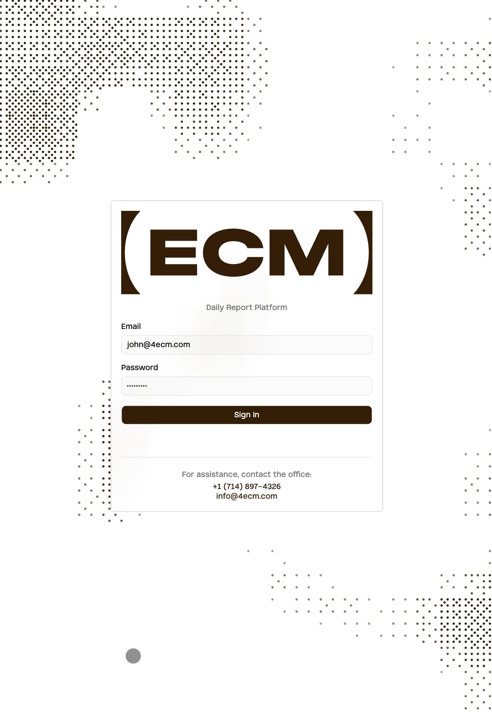
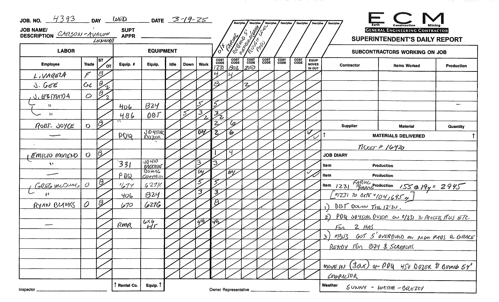

# ECM Daily Report Platform

A Progressive Web App for construction field crews to digitize superintendent daily reports. Built for **ECM (Earth Construction Mining)**, replacing handwritten paper forms with an offline-first mobile application that syncs to Airtable for office review and payroll processing. Part of a broader AI adoption strategy — digitizing field data to create the structured foundation for predictive analytics, cost forecasting, and automated compliance reporting.

<p align="center">
  
</p>

## The Problem

Construction foremen fill out daily reports on paper forms tracking labor hours, equipment usage, cost code allocations, subcontractor work, materials delivered, and job diary entries. These forms are error-prone, hard to read, and require manual collection + data entry into payroll systems. Reports must be submitted daily by 5pm the next day, with payroll summaries due Monday at noon.

<p align="center">
  
</p>

## The Solution

A mobile-first PWA that works offline in remote job sites, syncs automatically when connectivity returns, and structures data for direct export to payroll software.

---

## AI Adoption Strategy

This app is the first step in a broader AI integration strategy for construction operations. Digitizing daily reports creates the **structured data foundation** that makes downstream AI applications possible.

**Today** -- An embedded AI assistant (Claude 4.6 Sonnet) helps foremen fill out reports faster using natural language and voice input. It understands the form context and uses tool calls to populate labor entries, cost codes, diary notes, and more.

**Near-term** -- With structured, higher-quality daily report data flowing into Airtable, the next layer is automated insights: cost code budget burn-rate alerts, labor productivity trends across jobs, weather-adjusted scheduling recommendations, and anomaly detection (e.g., flagging unusually high equipment idle hours).

**Long-term** -- The data pipeline this app establishes feeds into predictive models for project cost forecasting, resource allocation optimization, job bidding, and automated compliance reporting. Every report submitted builds the dataset that gives future ECM AI agents greater context and accuracy.

**The bigger picture** -- Industries that have been slow to digitize can't benefit from AI without first building the digital infrastructure to give it context. Earthwork construction is one of these industries — and this app is the bridge. It meets foremen where they are, replaces a familiar paper workflow with something faster, and quietly builds the structured dataset and integrated system that makes every future AI capability possible.

---

## Architecture

```
                        Offline-First Architecture

                                          Airtable (REST API)
                                     +--------------------------+
                          Pull       |                          |
                       Master Data   |  Master Data (read-only) |
                    +----------------|  Jobs, Employees,        |
                    |                |  Equipment, Cost Codes,  |
                    v                |  Subcontractors          |
   +-----------------------+         |                          |
   |    React + Vite PWA   |         |  Transaction Data        |
   |                       | Upload  |  Daily Reports,          |
   |  +-----------------+  | Queue   |  Labor Entries,          |
   |  |     Dexie       |--|-------->|  CC Hours, Diary,        |
   |  |   (IndexedDB)   |  |         |  Subs, Deliveries,       |
   |  |                 |  |  Pull   |  Edit History            |
   |  |  Primary store  |<-|---------|                          |
   |  |  for all data   |  |         +--------------------------+
   |  +-----------------+  |
   |                       |
   |    Service Worker     |         +--------------------------+
   |    (Workbox PWA)      |         |    Anthropic API         |
   +-----------------------+  Proxy  |    (Claude 4.6 Sonnet)   |
   |  Vercel Serverless    |-------->|                          |
   +-----------------------+         +--------------------------+
```

### Data Flow

1. **Master data** (Jobs, Employees, Equipment, Cost Codes) is managed in Airtable and pulled to the app on startup and when coming online. Airtable is the source of truth for these tables.
2. **Transaction data** (Reports, Labor, Diary, etc.) is created locally in Dexie first, then pushed to Airtable via a sync queue with exponential backoff. The local DB is the primary store — Airtable serves as the remote archive for office access and payroll export.
3. **Foreign keys** are translated between local UUIDs and Airtable record IDs at sync boundaries via `resolveLinkedFields`
4. **Offline edits** are persisted in IndexedDB immediately, queued for upload, and sent when connectivity returns
5. **AI requests** are proxied through a Vercel serverless function to keep the Anthropic API key server-side. All Airtable calls go directly from the client.

---

## Key Features

### Daily Report Form
- **Labor + Equipment tracking** -- per-employee hours (ST/OT), trade classification, equipment assignment with idle/down/work hour splits
- **Cost code hour allocation** -- employees split hours across multiple cost codes per day, synced as a junction table to Airtable for payroll export
- **Production + Notes** (Job Diary) with cost code tagging, load counts, and yield calculations
- **Subcontractor work** and **materials delivered** tracking
- **Signature capture** with auto-save and resize handling
- **Photo attachments** with captions
- **Undo/Redo** across all form fields

### Offline-First Sync
- **Dexie (IndexedDB)** for instant local reads/writes with reactive queries
- **Upload sync queue** with linked-record FK resolution and exponential backoff (2s, 4s, 8s, 16s)
- **Download sync** with full-replace strategy for master data, upsert for transactions
- **Tombstone pattern** for propagating child entry deletions across sync boundaries
- **Cross-device visibility** -- all foremen on a job see each other's reports

### AI Assistant
- Claude 4.6 Sonnet with tool-based form filling
- Voice input via Web Speech API
- Adds/updates/removes labor, diary, subcontractor, delivery, and cost code entries
- Draggable floating panel with context-aware report understanding

### Edit History
- JSON snapshots + human-readable diffs for every submission
- All-or-nothing revert to any previous state
- Timeline UI showing who changed what and when

### PWA
- Installable on iOS/Android home screen
- Service worker precaching for offline app shell
- New-version notification banner with periodic update checks
- Offline/online status indicator

### Other
- **Budget PDF generation** matching ECM's branded format
- **Report PDF** with cost code column layout matching paper forms
- **Deadline tracking** -- daily and payroll deadlines with late indicators
- **Dark/light theme** with system preference detection
- **Custom WebGL Bayer noise background** on login page

---

## Tech Stack

| Layer | Technology |
|-------|-----------|
| Framework | React 19, TypeScript 5.9, Vite 7 |
| Styling | Tailwind CSS 4, shadcn/ui, Radix UI |
| Local DB | Dexie 4 (IndexedDB) with reactive queries |
| Remote DB | Airtable (REST API + Meta API) |
| AI | Claude 4.6 Sonnet via Anthropic API |
| PWA | vite-plugin-pwa, Workbox |
| Deployment | Vercel (static + serverless API proxy) |
| PDF | jsPDF |
| Signatures | react-signature-canvas |

---

## Project Structure

```
src/
  pages/             # Login, Jobs List, Reports List, Daily Report Form
  components/        # Labor, Diary, Signature, AI Assistant, Weather, etc.
    ui/              # Base UI components (Button, Card, Input, Combobox, etc.)
  contexts/          # Auth, Sync, Navigation, Theme providers
  hooks/             # useUndoRedo, useDelayedLoading
  lib/               # AI assistant, Airtable sync, edit history, PDF generators
  db/                # Dexie schema (v8), seed data
  types/             # TypeScript interfaces for all 15 entity types
api/
  claude.ts          # Vercel serverless proxy for Anthropic API
```

---

## Database Schema

15 tables across 3 categories:

**Master tables** (Airtable -> Local): Jobs, Employees, Equipment, Cost Codes, Subcontractors

**Transaction tables** (Local <-> Airtable): Daily Reports, Labor Entries, Labor Cost Code Hours, Job Diary Entries, Subcontractor Work, Materials Delivered, Photo Attachments, Edit History

**App tables** (Local only): Sync Queue, Tombstones, Auth Session

The schema is at version 8, with migrations handling cost code restructuring, Airtable field type conversions, and the labor cost code hours junction table.

---

## Development

```bash
npm install
npm run dev
```

### Environment Variables

Create a `.env` file:

```bash
VITE_AIRTABLE_API_KEY=your_airtable_personal_access_token
VITE_AIRTABLE_BASE_ID=your_airtable_base_id
ANTHROPIC_API_KEY=your_anthropic_api_key  # Server-side only (Vercel)
```
